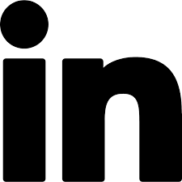

## Hi, I'm Melissa 🖖

I just graduated the [neuefische coding bootcamp](https://www.neuefische.de/). 

In this time I learned a lot about HTML, CSS, JavaScript, Testing, React, node.js, MongoDB and a lot of more interesting stuff. 🤓

 🌱 I’m currently learning and practicing by working on my capstone-project (coucou!). 

## How to contact me 🕊

 

